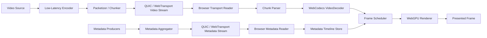
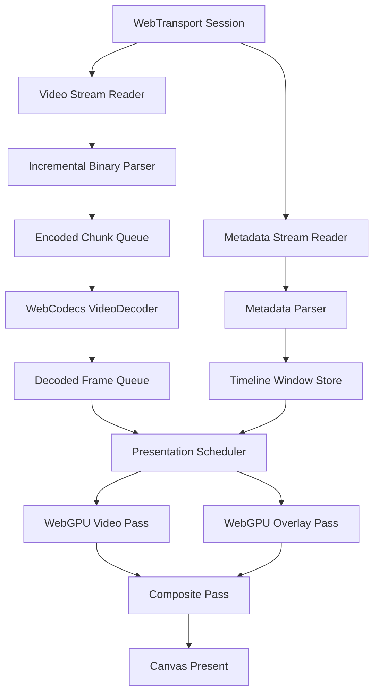
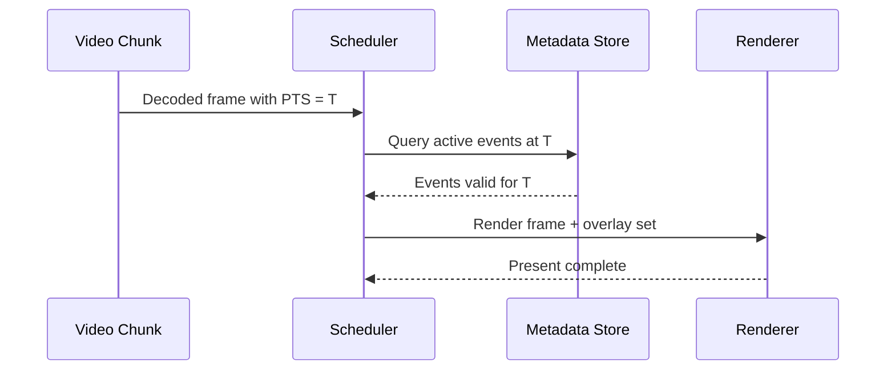
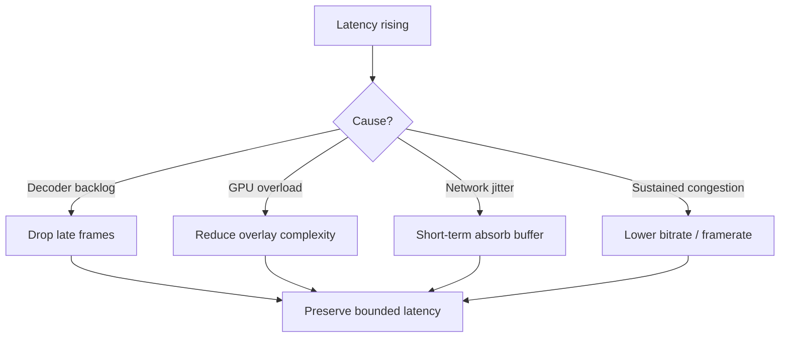
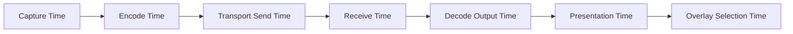

# Architecture Diagrams

## 1. End-to-End System

```mermaid
flowchart LR
  A[Video Source] --> B[Low-Latency Encoder]
  B --> C[Packetizer / Chunker]
  C --> D[QUIC / WebTransport Video Stream]

  E[Metadata Producers] --> F[Metadata Aggregator]
  F --> G[QUIC / WebTransport Metadata Stream]

  D --> H[Browser Transport Reader]
  G --> I[Browser Metadata Reader]

  H --> J[Chunk Parser]
  J --> K[WebCodecs VideoDecoder]
  K --> L[Frame Scheduler]

  I --> M[Metadata Timeline Store]
  M --> L

  L --> N[WebGPU Renderer]
  N --> O[Presented Frame]
```

## 2. Browser Pipeline Detail

```mermaid
flowchart TD
  A[WebTransport Session] --> B[Video Stream Reader]
  A --> C[Metadata Stream Reader]

  B --> D[Incremental Binary Parser]
  D --> E[Encoded Chunk Queue]
  E --> F[WebCodecs VideoDecoder]
  F --> G[Decoded Frame Queue]
  G --> H[Presentation Scheduler]

  C --> I[Metadata Parser]
  I --> J[Timeline Window Store]
  J --> H

  H --> K[WebGPU Video Pass]
  H --> L[WebGPU Overlay Pass]
  K --> M[Composite Pass]
  L --> M
  M --> N[Canvas Present]
```

## 3. Metadata Timing Model

```mermaid
sequenceDiagram
  participant V as Video Chunk
  participant S as Scheduler
  participant M as Metadata Store
  participant R as Renderer

  V->>S: Decoded frame with PTS = T
  S->>M: Query active events at T
  M-->>S: Events valid for T
  S->>R: Render frame + overlay set
  R-->>S: Present complete
```

## 4. Live Degradation Strategy

```mermaid
flowchart TD
  A[Latency rising] --> B{Cause?}
  B -->|Decoder backlog| C[Drop late frames]
  B -->|GPU overload| D[Reduce overlay complexity]
  B -->|Network jitter| E[Short-term absorb buffer]
  B -->|Sustained congestion| F[Lower bitrate / framerate]
  C --> G[Preserve bounded latency]
  D --> G
  E --> G
  F --> G
```

## 5. Time Domains

```mermaid
flowchart LR
  A[Capture Time] --> B[Encode Time]
  B --> C[Transport Send Time]
  C --> D[Receive Time]
  D --> E[Decode Output Time]
  E --> F[Presentation Time]
  F --> G[Overlay Selection Time]
```
